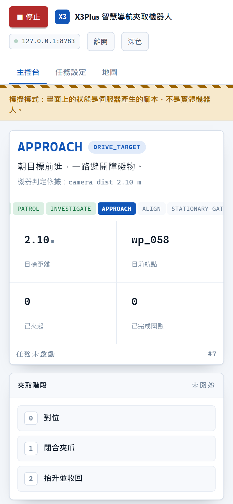
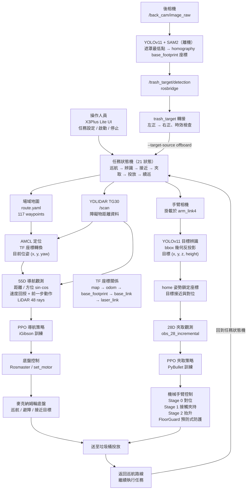

# iGibson Navigation & Grasping

[](https://github.com/koala915/iGibson-Navigation-Grasping/actions/workflows/tests.yml)
[](LICENSE)
[](#快速開始)

> 透過機器視覺與強化學習，讓一台 Yahboom X3Plus 從環境感知、自主避障導航，
> 到精準夾取物品並投入垃圾桶 —— 完整跑完一輪，不需要人在終端機前面。

Sim-to-real deployment of a PPO 6-DOF grasping policy on a Yahboom X3Plus
(mecanum base, 5-DOF arm, Jetson Nano). A YOLOv11 arm camera locates the
object, a PPO policy aligns and closes the jaw by contact detection, and a
21-state mission machine drives the patrol → detect → approach → grasp →
deliver loop. Everything runs in one Python 3.8 process that owns the serial
port, with a web console for the operator. Navigation was trained in iGibson
and grasping in PyBullet. First successful physical grasp: 2026-07-31.

<p align="center">
  
  
  
</p>

---

## 任務流程

機器人沿預錄路線巡航，用手臂相機找地上的目標物，轉向接近後以 PPO 策略夾取，
帶到垃圾桶投放，再回到路線上。



目標偵測有兩個可切換的來源，兩者都回傳同一組 `(found, 前向距離, 右正橫向偏移)`，
所以下游的一致性閘、黑名單與狀態機完全相同：

| `--target-source` | 來源 | 特性 |
|---|---|---|
| `onboard`（預設） | 機上後相機 YOLO bbox | 不依賴外部連線 |
| `offboard` | 離機 YOLO + SAM2 遮罩最低點 | 接地點較準，但需 rosbridge 連線 |

離機來源逾時（預設 1 秒，以**本地到達時間**計算而非發布端時鐘）即回報「沒偵測到」，
機器人繼續巡航而不是朝著過期座標前進。

四種執行模式共用同一套夾取核心與狀態名稱：

| 模式 | 用途 | 入口 |
|------|------|------|
| 完整任務 | 巡航→辨識→接近→夾取→投放→續巡，21 狀態任務機 | [`integration/mission_pipeline.py`](integration/mission_pipeline.py) |
| 模式 A | 自走夾取全流程（雙相機導航 → 夾取 → 驗證重試 ≤3） | [`integration/vision_grasp_pipeline.py`](integration/vision_grasp_pipeline.py) |
| 模式 B | 除錯用：辨識與夾取拆成兩個行程，TCP 5555 傳座標 | [`integration/vision_grasp_bridge.py`](integration/vision_grasp_bridge.py) |
| 模式 C | RL 導航避障（PPO + 48 束 LiDAR）→ 精對位 → 夾取 | [`integration/nav_rl_grasp_pipeline.py`](integration/nav_rl_grasp_pipeline.py) |

---

## 虛實整合

導航策略在 [iGibson](https://svl.stanford.edu/igibson/) 的室內場景中訓練（48 束 LiDAR，
局部避障與趨近目標），夾取策略在 PyBullet 中以 6D 增量動作訓練。訓練端是另一個 repo：

| Repo | 職責 |
|------|------|
| [koala915/igibson_x3_test](https://github.com/koala915/igibson_x3_test) | 訓練、評估、選模、打包 |
| 本 repo | 部署、實機控制、安全閘、任務整合 |

權重經 `model_tools/` 打包，以 SHA256 與契約字串綁定後發佈，部署端驗證通過才載入。
流程見 [`docs/planning/MODEL_RELEASE_WORKFLOW.md`](docs/planning/MODEL_RELEASE_WORKFLOW.md)。

### 訓練 plant 的復刻

導航策略學到的動力學來自模擬器，部署端逐項沿用同一組數值而未重新調參
（[`integration/nav_rl.py`](integration/nav_rl.py) 的 `NavRLConfig`，註解要求
"Do not tune the plant"）：

| 特性 | 訓練端（iGibson） | 部署端（實機） |
|------|------------------|---------------|
| 控制頻率 | `action_repeat(5) × 1/30 s` ≈ 6 Hz | `control_period_s = 1/6` |
| 馬達延遲 | 2 步 | `motor_delay_steps = 2` |
| 油門→速度 | 前進 ×0.5、後退 ×0.15 m/s、轉向 ×1.2 rad/s | 同左，逐項相同 |
| 近障調速 | 0.66 m 內線速度降到 ×0.24 | `near_obstacle_slowdown_dist = 0.66` |
| 脫困助推 | 最低油門 0.28 | `stall_assist_min_throttle = 0.28` |
| LiDAR | 48 束、180° FOV | `lidar_num_rays = 48` |

夾取端的契約同樣綁定：v21 為 `obs_28_incremental`（增量），v17/v18 為 absolute。
兩者 shape 都是 28D/6D，shape 檢查無法區分，混用會導致手臂暴走，因此以 manifest
的 sha256 為唯一憑據。

---

## 硬體與技術棧

| 項目 | 內容 |
|------|------|
| 底盤／手臂 | Yahboom X3Plus：麥克納姆輪底盤 + 5-DOF 機械臂 + 夾爪 |
| 運算 | Jetson Nano（JetPack），Rosmaster 擴充板經 `/dev/myserial` |
| 夾取策略 | Stable-Baselines3 PPO，28D 觀測 / 6D 動作，incremental 控制 |
| 物理 | PyBullet（僅用於 FK，headless，不跑模擬） |
| 視覺 | YOLOv11（Ultralytics），單類別 `sugarbox`；後相機另有 SAM2 遮罩路線（離機） |
| 定位 | AMCL + `/scan`，rosbridge 收發，odom 由輪速回推 |
| 操作介面 | 純標準函式庫的 HTTP + SSE 伺服器，手機瀏覽器即可操作 |

---

## 專案結構

```
grasp/          夾取：PPO 策略部署、伺服機控制、URDF/FK、安全閘
  v21/            現行夾取流程（唯一在實機夾取成功過的版本）
  v23/            E1 實機候選控制器（分支中，尚未接模式 A/B/C）
  v24/            訓練端 E1 replacement 候選 pair；鎖檔 wrapper 重用 v23 控制器
  x3plus/         PyBullet FK 用的 URDF 與 meshes
detection/      辨識：YOLOv11 手臂相機、bbox→距離幾何、相機校正
integration/    整合：任務機、路線、里程計、ROS I/O、四種執行模式
ui/             操作台：手機/筆電網頁介面、任務程序監督、安全閘
tests/          跨模組回歸測試
model_tools/    模型打包、驗證、發佈流程
docs/           校正計畫、交接文件、規劃與操作清單
```

各資料夾的檔案逐項說明見 [`CLAUDE.md`](CLAUDE.md)；程式碼導覽見 [`INDEX.md`](INDEX.md)。

---

## 快速開始

需求：Python 3.8（Jetson 上）、`/dev/myserial` 可用、Rosmaster_Lib 已本地化。

```bash
# 1) 安裝相依
pip install -r grasp/requirements_jetson.txt
pip install -r detection/requirements_detection.txt

# 2) 本地化 Rosmaster 驅動（解決 Py3.8 找不到 Py3.6 驅動）
cd grasp && cp -r /usr/local/lib/python3.6/dist-packages/Rosmaster_Lib .
```

上機前檢查（不驅動硬體）：

```bash
./grasp/v21/jetson_verify.sh
```

空跑，目視確認角度合理後再接伺服機：

```bash
python3 grasp/v21/x3plus_real_grasp.py --model grasp/v21/models/candidate_v21_seed816_ckpt550000.zip --vecnorm grasp/v21/models/candidate_v21_seed816_ckpt550000_vec.pkl --contract obs_28_incremental --object-height 0.03 --obj-x 0.2563 --obj-y -0.0035 --obj-z 0.015
```

操作台（開發機無硬體亦可執行）：

```bash
python3 ui/server.py --simulate
```

完整的部署指令、旗標說明與各模式差異見 [`CLAUDE.md`](CLAUDE.md) 與
[`integration/README.md`](integration/README.md)。

---

## 測試

以下測試不需要硬體：

```bash
python3 grasp/v21/test_deploy_controller.py    # 138 checks — 部署控制器
python3 grasp/v21/test_servo_read.py           #  37 checks — 半雙工匯流排讀取
python3 grasp/v21/test_deploy_floor_guard.py   # 641 checks — 預防式地板防護
python3 ui/test_server.py                      #  48 tests  — 操作台伺服器
python3 tests/test_safety_guards.py            #  68 tests  — 安全閘
python3 tests/test_mission_end_to_end.py       #  28 tests  — 任務層端到端
python3 tests/test_model_package.py            #  11 tests  — 模型打包驗證
python3 tests/test_trash_target.py             #  18 tests  — 離機目標轉接（符號慣例）
```

另有四支純邏輯自測（不需相機、硬體或 torch）：

```bash
python3 integration/mission_fsm.py --selftest
python3 integration/mission_pipeline.py --selftest
python3 integration/vision_grasp_pipeline.py --selftest
python3 integration/ros_io.py --selftest
```

---

## 安全設計

- 未帶 `--real` 時只印出伺服機指令而不送出。首次連接硬體前先跑一次空跑並目視確認角度。
- `--allow-real` 與介面確認目前只是操作台的前兩道閘。A/B/C 所需的 serial owner、
  LiDAR 方向與 grasp-home homography 證據尚未由操作台提交，因此三種實機請求都會
  fail-closed；完整任務只能 dry-run。
- v21 權重的 manifest 狀態為 `candidate`，`--real` 另需 `--unlock-candidate-real`，
  並要求操作者在場。
- FloorGuard 為預防式：在指令送出前夾住會使夾爪穿越地板的動作，而非事後回報。
- 夾持採接觸偵測：連續兩次「指令已前進但角度未跟上」即判定接觸，指令停在接觸角加
  8° 的 hold 位置，不再推向全閉停點。這同時是夾持力來源與齒輪研磨的防線。
- 網頁停止鈕送出 `SIGINT`，走任務自身的關機路徑以確保輪子歸零；夾取途中按下會等
  該次夾取結束。實體電源開關才是急停，介面上亦如此標示。

---

## 已知限制

- URDF 的手指比實體長 16.7 mm，尚未修正（需等 v22 重訓）。紙球、瓶蓋一類的矮物體
  目前夾不到。
- v21 有三個硬體 gate 未通過：`guard_margin_8mm_validated_on_hardware`、
  `c3_real_reach_envelope`、`object_heights_measured`。manifest 狀態因此維持
  `candidate`。
- 手臂相機固定於 `arm_link4`，會隨手臂移動，其固定高度與俯仰角僅在 home 姿勢成立。
  視覺夾取須在 home 鎖定一次座標。
- 操作台不提供相機畫面。Jetson Nano 的 RAM 使用率已達九成，在控制迴路中編碼 JPEG
  是操作台成本最高的一項，該路徑已於 2026-08-06 移除並有測試阻擋其回歸。
- v21 與 v17/v18 的權重不可混用（incremental 對 absolute），原因見上節。
- 完整任務的 final align/latch 尚未接入量測過的 grasp-home homography；
  `mission_pipeline.py --real` 會在開啟任何裝置前拒絕。

---

## 文件

| 文件 | 內容 |
|------|------|
| [`CLAUDE.md`](CLAUDE.md) | 完整檔案結構、部署指令、關節映射、觀測空間、三段式控制 |
| [`INDEX.md`](INDEX.md) | 程式碼導覽 |
| [`TROUBLESHOOTING.md`](TROUBLESHOOTING.md) | 踩過的坑：症狀 → 原因 → 解法 → 教訓 |
| [`progress.md`](progress.md) | 開發進度與實機測試紀錄 |
| [`integration/MISSION.md`](integration/MISSION.md) | 完整任務流程與狀態機 |
| [`integration/NAV_RL.md`](integration/NAV_RL.md) | 模式 C 的 RL 導航設計 |
| [`docs/calibration/`](docs/calibration/) | 相機／底盤校正計畫與量測值、手臂姿態設計 |
| [`docs/operations/`](docs/operations/) | 上機檢查清單、開機設備檢查、模式 B 測試計畫 |
| [`docs/handoff/`](docs/handoff/) | 訓練端／部署端交接文件 |
| [`docs/planning/`](docs/planning/) | 任務規劃、訓練需求、模型發佈流程 |

---

## 授權

[MIT](LICENSE)
