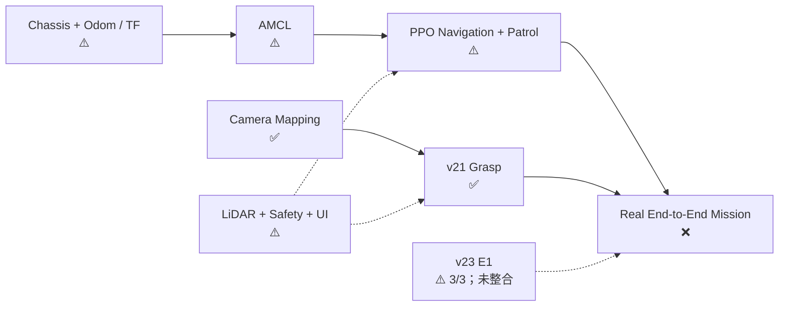
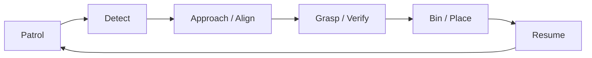

# Summer Meeting PPT Plan

> 建議：8 頁、約 8–12 分鐘。教授已了解背景，因此從成果直接開始。
> 整份簡報固定使用：`✅ 已有明確範圍的驗證`、`⚠️ 部分完成／尚缺硬體證據`、`❌ 尚未完成`。

## Slide 1 — Summer Results Overview

### Bullets

- ✅ v21：完成實機 PPO 夾取，並跑通一次單指令「視覺辨識 → 夾取」
- ⚠️ v23 E1：固定視角夾取 3/3，落點校正達次公分，但仍是候選分支
- ⚠️ 完成 Feedback Odom／TF、AMCL、PPO Navigation 與 83-point patrol runtime
- ⚠️ 完成 21-state Mission FSM、單一 serial owner、Safety gates 與手機操作介面
- ❌ 尚未完成實車 patrol → detect → grasp → bin → resume 全循環

### Visual

- 用五張大型 status cards 呈現上述成果；不要放專案背景圖。
- 每張卡只保留「成果名稱＋✅/⚠️/❌＋一個數字」，例如 `v23 E1 3/3`、`Mission 21 states`。

### Speaker Notes

- 先說結論：暑假不是只做出程式，而是讓夾取子系統真正上機成功；整體系統則完成軟體整合、尚差實車閉環。
- `3/3` 是受監督、單一 E1 可辨識區的結果，不當作長期成功率。

## Slide 2 — Current System Status

### Bullets

- 夾取是目前唯一具有完整動作鏈實機成功證據的核心子系統
- Localization／Navigation／Patrol 已有 runtime，但硬體 gates 與長程 repeatability 未完成
- Full Mission 尚未通過一次完整實車循環

### Visual

### Speaker Notes

- `✅` 是有明確 scope 的驗證：Camera mapping 是固定姿態；v21 是受監督定點／單次視覺夾取。
- AMCL 曾在正確啟動順序下恢復可用，但尚無一整圈資料，所以仍標 `⚠️`。

## Slide 3 — Measured Perception & Calibration Results

### Bullets

- ✅ 相機內參：arm／rear reprojection RMS = `0.495 / 0.374 px`
- ✅ Nav-home mapping：最大 X／Y 誤差 = `0.39 / 0.33 cm`
- ✅ E1 homography：7 fit + 2 holdout；RMSE `0.388 cm`，holdout max `0.603 cm`
- ⚠️ TG30 `/scan≈10.17 Hz` 已量到；policy 的前方方向與手臂自遮擋仍待現場 gate

### Visual

- 左側：E1 相機畫面 `docs/images/pose_E1.jpg`。
- 右側：三列數據卡（Camera RMS、Nav-home error、E1 homography error）。
- LiDAR 數據卡加上明顯註記：`Topic OK ≠ orientation verified`。

### Speaker Notes

- 強調姿態綁定：nav-home 與 E1 的 calibration 不可混用。
- E1 數值只保證量測凸包內；不能外推到左右掃描或整個模型 workspace。

## Slide 4 — Grasping Reached Real-Hardware Success

### Bullets

- ✅ v21：3 cm 物體完成 contact、lift 6/6、return home、回家後仍夾持
- ✅ v21 一鍵流程：YOLO 約 `1.096 s/frame`；servo failures `0`；guard pass `46`
- ⚠️ v23 E1：operator-reported `3/3`；reviewed run lift 6/6、guard pass 45、bus failures 0
- Offline v21：235 episodes；25/25 bottle-cap、75/75 mixed、grid worst `86.67%`
- 邊界：v21／v23 都仍標 `candidate`；v23 尚未接入 Mission modes

### Visual

- 並排 `docs/images/pose_C3.jpg` 與 `docs/images/pose_E1.jpg`，標成「v21 C3」與「v23 E1」。
- 下方只放一張 3-column 表：`Version / Real result / Remaining gate`。

### Speaker Notes

- v21 的 235 episodes 是 simulation evidence，且正式 protocol 因 home jitter 不符而 `protocol_valid=false`。
- v23 的 3/3 是單一 E1 可辨識區、受監督結果；原始 reviewed log 目前只留在 Jetson，不在 repository。

## Slide 5 — Navigation & Patrol Are Software-Ready, Not Yet Hardware-Proven

### Bullets

- ⚠️ Feedback Odom／TF 以 20 Hz 目標發布，AMCL startup-order 問題已定位並修正
- ⚠️ PPO Navigation：55D→2D、48 rays、2-step delay、近障降速與 `<0.25 m` 幾何煞停
- Offline 預設模型：success `18/30`、collision `8/30`；真權重虛擬路徑 `4/4`
- Route runtime：`117 → 83` points、min gap `0.049 → 0.530 m`、loop `58.2 m`
- ❌ 實車 T1–T4：odom 尺度、LiDAR orientation、一圈巡航、巡航辨識皆未完整 PASS

### Visual

- 使用 `docs/images/ui/07_mobile_map.png`，旁邊清楚標示「Simulation UI／83-point route，不是實車巡航證據」。
- 加一條短 evidence ladder：`Offline policy ✅ → Sensor gate ⚠️ → Real lap ❌`。

### Speaker Notes

- AMCL 成功不等於 Navigation 完成；能輸出速度也不等於巡航穩定。
- route／site map 位於相鄰 Navigation workspace，不在本 repository，是目前重現性依賴。

## Slide 6 — Mission Integration & Validation Coverage

### Bullets

- 完成 21-state flow：patrol → investigate → approach → align → grasp → verify → deliver → resume
- 單一 Rosmaster owner，FSM 保證 wheels／arm 不同時允許動作；sensor stale 時 fail closed
- 支援 onboard YOLO、offboard SAM2、AMCL refresh、E-stop、retry／blacklist 與手機 UI
- Current rerun：Mission E2E `23`、Safety `63`、UI `47` tests 全過
- Offline preflight：`24 pass / 0 warn / 0 fail`；但這不是 `--real` 結果

### Visual

- Mermaid 下方放兩個分區：`Software evidence ✅` 與 `Full real loop ❌`。

### Speaker Notes

- 完整循環目前是在 fake hardware 上跑通；這證明接口與狀態轉換，但沒有證明場地中的穩定性。
- 投放狀態的 `released` 只代表放爪動作結束，沒有感測器確認物體進桶。

## Slide 7 — Three Remaining Problems

### Bullets

- **Navigation input 未認證**：odom T1 與 LiDAR 四方向／自遮擋未過 → 不能安全跑 patrol
- **Full mission 無實車證據**：T3–T6 未閉環 → 不能宣稱 End-to-End 或穩定 demo
- **v23 尚未產品化**：未整合、硬體 gates 未齊、latest 3/3 evidence 尚未完整封存

### Visual

| Problem | Impact | Immediate Fix |
|---|---|---|
| Odom／LiDAR physical gate | Navigation 方向或 brake 可能錯 | 完成 T1/T2 並保存 raw evidence |
| No full real loop | 模組成果無法轉成系統成果 | 依 T3→T6 分段驗收 |
| v23 candidate only | E1 改善無法被 Mission 使用 | 封存、認證、再做 stack integration |

### Speaker Notes

- 不列小 bug；這三件事正好對應「安全啟動」「系統閉環」「下一版夾取升級」。
- AMCL 丟失後目前會 PAUSED 等人工重設；這是已知限制，不是自動恢復已完成。

## Slide 8 — Next Step: Stabilize the Existing System

### Bullets

- **P0** 保存 v23 branch／manifest／Jetson log／hash，建立可重現 baseline
- **P0** 完成 T1/T2：odom 20 Hz、50 cm ±10%、TF owner、LiDAR orientation／self-occlusion
- **P1** 用 v21 依 T3→T6 跑出第一次完整實車循環，再達到至少 `2/3` repeatability
- **P1** v23 完成 current-revision gates 後，以可切換 stack 接入 Mission，保留 v21 rollback
- **P2** 再加入 AMCL auto-recovery、投放確認與 navigation model 同場 A/B；暫不做 v24

### Visual

- 三層階梯：`P0 Physical Truth → P1 End-to-End → P2 Reliability`。
- 每層只放 exit criterion：`T1/T2 PASS`、`1 loop then ≥2/3`、`recovery + A/B`。

### Speaker Notes

- 下一階段不擴功能，先把現有模組變成可重複的完整系統。
- 第一個整機 baseline 先固定 v21；v23 在自己的 gates 過後再替換，避免同時改導航與夾取造成不可歸因。
