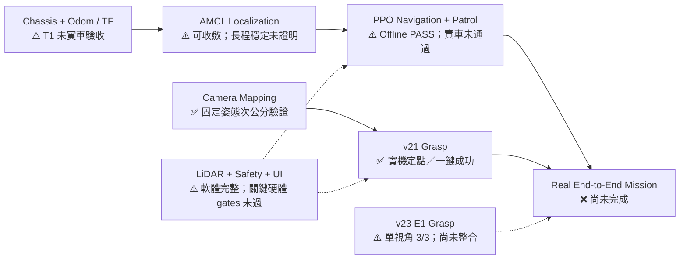

# Summer Results Report

> 盤點基準：2026-09-06；branch `v23-grasp-test`；HEAD `a7143bc`。
> 本報告依「最新實機測試 → 最新 progress / handoff / test 文件 → 最新程式碼 → Git history → README」判讀。
> `✅ Verified` 只代表表中寫明的範圍已驗證，不代表整台機器人的 End-to-End 任務已完成。

## Executive Verdict

暑假已把「感測／座標轉換／PPO 導航／PPO 夾取／Mission FSM／操作介面」組成一套可離線驗證的系統，且夾取子系統已有實機成功證據；但導航、巡航與投放尚未完成分段實車驗收，因此目前應定位為：**夾取已達實機子系統成果，整體任務仍是 Partial，尚未達成可重複的 End-to-End demo。**

## Top Results

1. **完成 v21 實機 PPO 夾取閉環 — ✅ Verified（定點／單次視覺辨識範圍）**
   3 cm 物體完成接觸判定、六段抬升、回 home 與回家後持續夾持；之後又完成一次 Jetson 單指令「到 C3 → YOLO → PPO 夾取」。

2. **完成 v23 E1 高姿態單視角夾取候選 — ⚠️ Partial / Unstable**
   E1 實測 homography 達次公分誤差，最新組合在可辨識區內由操作者回報 3/3 成功，且一份完整 run 已在文件中核對；但 v23 尚未併入整合模式，仍有 motion envelope、dry-run 與左右掃描硬體 gate 未完成。

3. **建立 PPO Navigation、Feedback Odometry／TF 與 AMCL 接線 — ⚠️ Partial / Unstable**
   已具備 55D→2D 導航 policy、48 束 LiDAR、20 Hz odom publisher、`odom→base_footprint` TF、AMCL quality gate 與 no-motion refresh；離線與模擬可運作，但實車 T1/T2 與長距離定位穩定度尚未驗收。

4. **完成 Route／Patrol 與 21-state 任務整合骨架 — ⚠️ Partial / Unstable**
   系統可在假硬體走完 patrol → detect → approach → align → grasp → verify → bin → place → resume，並維持單一 serial owner；尚無實車完成一整圈或完整任務的證據。

5. **建立 fail-closed Safety、Preflight 與手機操作介面 — ⚠️ Partial / Unstable**
   已具備 LiDAR 不可信即拒駛、FloorGuard、權重／contract hash、相機姿態、AMCL、序列埠與操作員確認等閘門；目前本機主要回歸全數通過，但 LiDAR 物理方向、guard 臨界介入與整機安全仍需實測。

## Module Results

| Module | Completed | Result | Validation | Status |
|---|---|---|---|---|
| Motor / Chassis / Odom / TF | 將 Rosmaster motion feedback 做尺度校正與弧長積分；建立獨立 20 Hz odom thread、`/odom_setmotor` 與 TF；讀取失敗時凍結 pose 並取消 stationary 判定 | Mission 可用同一個 serial owner 控制輪子與手臂，並提供 AMCL 所需 odom | selftest 與 Mission E2E 測試通過；文件保存 Route A 方形閉合誤差 7.83 cm。但目前 repository 沒有本次 T1 的 `/odom_setmotor≈20 Hz`、手推 50 cm ±10% 實測紀錄 | ⚠️ Partial / Unstable |
| LiDAR | 確認 TG30 驅動、ROS `/scan` 接線、48-ray 轉換與近障幾何煞停；real mode 要求 orientation evidence | 可供 AMCL 與 PPO navigation 使用，資料失效時拒絕前進 | 實機 driver：firmware 2.1、health good、20K sample rate、`/scan≈10.17 Hz`、角度約 −85°～+85°；但四方向板子 gate 與手臂自遮擋測試未完成 | ⚠️ Partial / Unstable |
| Map / Localization | 接上 map server／AMCL pose quality gate；修正「先定位、後啟動 pipeline」造成 odom 原點重設的問題；加入 `/request_nomotion_update` | 正確啟動順序下 AMCL 可重新收斂，夾取後可主動要求靜止定位更新 | 最新 troubleshooting 記錄實機收斂問題與修正；沒有一整圈或長時間 covariance 穩定數據，丟失定位仍需人工重設 | ⚠️ Partial / Unstable |
| PPO Navigation | 打包預設權重與 VecNormalize；重建訓練 plant、2-step delay、stall assist、近障降速、48-ray observation 與幾何煞停 | 可對任意 goal 輸出底盤速度，並供 patrol／target／bin 三種 goal source 共用 | 預設模型模擬 18/30 成功、8/30 碰撞；真權重虛擬 episode 4/4，CPU 推論約 4.7 kHz；未做實車同場 A/B 或導航成功率測試 | ⚠️ Partial / Unstable |
| Patrol / Waypoints | 實作 route 解析、禁區、到點、繞行、中斷續巡與弧長重取樣 | 外部 Route C 可由 117 點重取樣為 83 點，避免 4.9 cm 密集點造成一次跳多點 | Offline preflight 可載入外部 route；重取樣後最小間距 0.530 m、路線約 58.2 m；實車一圈 T3 尚未執行 | ⚠️ Partial / Unstable |
| Camera / Fixed-pose Mapping | 完成雙相機 intrinsics、nav-home 距離／base mapping，以及 v23 E1 專用 pixel→base homography | 能在已校正姿態將 detection 轉成 policy base-frame target；不再混用錯誤姿態外參 | Arm/rear RMS 0.495/0.374 px；nav-home 四點最大 X/Y 誤差 0.39/0.33 cm；E1 7 fit + 2 holdout，fit RMSE 0.388 cm、holdout 最大平面誤差 0.603 cm | ✅ Verified（固定姿態與量測範圍） |
| Detection / Handoff | 支援 onboard YOLO、offboard rear-camera SAM2 target、freshness／pose stamp／latch、視覺精對位 | 定點一鍵夾取已使用真實 detection；Mission 可接收遠端目標並切換到 approach／align | v21、v23 單視角夾取已有實機 detection；巡航中連續辨識、INVESTIGATE→ALIGN 的 T4 明列為「從未實測」 | ⚠️ Partial / Unstable |
| Grasping v21 | 完成 28D／6D incremental policy、接觸判定、scripted lift／return、FloorGuard 與 hash／contract gate | 已能在受監督情況下對實物完成夾取、抬升、回 home | 2026-07-31 3 cm 物體完整 log 摘要；2026-08-03 一鍵辨識＋夾取成功，lift 6/6、servo 無失敗、guard pass 46 | ✅ Verified（受監督定點夾取；package 仍為 candidate） |
| Grasping v23 | 改為 E1 高姿態與新權重；加入 E1 homography、+X 落點修正、TCP／finger correction、jaw slow-tracking contact 與三姿態掃描框架 | E1 可辨識區內的單指令夾取已重複成功，視野／落點比 v21 C3 更實用 | 操作者回報 3/3；一份 reviewed run：S6 152° 接觸、hold 153°、lift 6/6、return、bus 無失敗、guard pass 45 | ⚠️ Partial / Unstable（未整合、未完整硬體認證） |
| Safety / Operator UI | wheels／arm 狀態互斥、stale sensor fail-safe、LiDAR 方向證據 gate、FloorGuard、E-stop、重試／黑名單、HTTP/SSE 手機介面 | 在不可信感測或錯誤 contract 下拒絕 real movement；操作員可啟停、觀察任務與地圖 | 本次本機：Safety 63 tests、UI 47 tests 皆 PASS；UI 截圖為 simulation mode，不是實車任務證據；hardware guard margin 尚未驗證 | ⚠️ Partial / Unstable |
| System Integration / End-to-End | 21-state FSM 與 MissionRunner 已串接 odom、AMCL、route、PPO nav、target、v21 grasp、place、resume | 假硬體可跑完整循環，程式架構具備完整 mission path | 本次 Mission E2E 23 tests、offline preflight 24 pass / 0 warn / 0 fail；實車 T3–T6 沒有完整 PASS 紀錄 | ❌ Not completed（實機 End-to-End） |

## Quantitative Results

### Real-hardware evidence

| Result | Value | Interpretation / Boundary |
|---|---:|---|
| TG30 `/scan` frequency | 約 10.17 Hz | Sensor topic 已實測；不代表 policy 的物理前方方向已正確 |
| Arm / rear camera reprojection RMS | 0.495 / 0.374 px | Intrinsics calibration evidence |
| Nav-home camera→base max error | X 0.39 cm；Y 0.33 cm | 只適用該實測姿態／範圍 |
| E1 homography | 7 fit + 2 holdout；RMSE 0.388 cm；holdout max 0.603 cm | PASS ≤1 cm gate；只適用 E1 與量測凸包 |
| v21 first physical grasp | 3 cm object；lift 6/6；return 5 steps | 完整 log 摘要在 manifest；受監督定點測試 |
| v21 one-command run | YOLO 約 1096 ms/frame；lift 6/6；guard pass 46；servo failures 0 | 只有一個成功 run，不足以宣稱穩定成功率 |
| v23 E1 one-command run | 3/3 operator-reported；reviewed run lift 6/6、guard pass 45、servo failures 0 | 一份完整 run 被文件核對；原始 Jetson log 不在目前 repository |
| v23 minimum object height at one point | 3 cm 可夾；2 cm 空夾 | 單點門檻，不是整個 workspace 的高度能力 |

### Simulation / offline evidence

| Result | Value | Interpretation / Boundary |
|---|---:|---|
| v21 formal simulation | 235 episodes | Bottle-cap 25/25；mixed height 75/75；9-grid worst cell 86.67% |
| v21 floor behavior in simulation | 0 floor-violation；最低 clearance 3.99 mm；knocked 0 | 成績有效，但 protocol `home_jitter_exact=false`，所以正式 verdict `protocol_valid=false` |
| Default navigation model | success 0.600 (18/30)；collision 0.267 (8/30)；timeout 0.133 | 訓練機評測，不能替代實車 navigation PASS |
| Doorway candidate | standard success 0.683；collision 0.183；doorway 10/10 | 尚未升為預設；必須等同場實車 A/B |
| Real-weight virtual navigation | 4/4 goal reached；約 4.7 kHz CPU inference | 證明部署鏈與 policy 可執行，不證明實車避障穩定 |
| Route resampling | 117 → 83 points；min gap 0.049 → 0.530 m；loop 58.2 m | route/map 是 repository 外部依賴；尚未完成實車一圈 |

### Verification rerun on the current workspace

| Suite | Result |
|---|---:|
| v21 controller / servo read / floor guard / launcher | 119 / 37 / 641 / 29 checks PASS |
| v23 controller / servo read / floor guard / launcher / three-pose | 148 / 37 / 641 / 50 / 89 checks PASS |
| Safety guards / Mission E2E / vision bridge pose / UI | 63 / 23 / 20 / 47 tests PASS |
| `integration/preflight.py --offline` | 24 pass / 0 warn / 0 fail |
| Mission FSM / pipeline / odom / ROS I/O / map goal / nav selftests | PASS |

> 這些是本機離線驗證；沒有 `--real`，不可視為實機 PASS。

## Current Status

一句話：**Grasping 已有實機成果，Localization／Navigation／Patrol 具備可執行軟體與離線證據，但完整 patrol → detect → grasp → bin → resume 尚未在實車閉環。**

## Remaining Issues

### 1. Navigation 的物理輸入尚未認證

- **問題**：缺少現行 pipeline 的 odom T1 實測，以及 LiDAR 前／後／左／右 orientation marker；手臂是否遮住掃描面也未測。
- **影響**：policy 可能把後方當前方、煞停失效，或因自遮擋永遠不前進；因此不能安全宣稱 navigation／patrol 完成。
- **下一步**：同一套 launch 下完成 `/odom_setmotor≈20 Hz`、手推 50 cm ±10%、TF 單一發布者、四方向板子與 nav-home／E1 自遮擋測試，保存原始 JSON／topic log。

### 2. 沒有實車 End-to-End 任務證據

- **問題**：T3 一圈巡航、T4 巡航中辨識與交棒、整合 T5、T6 投放／續巡都沒有完成紀錄；release 只有「動作完成」，沒有物體確實入桶的感測驗證。
- **影響**：目前只能說模組存在且離線可串接，不能說整體系統已完成或穩定。
- **下一步**：先用 v21 固定 baseline 依 T3→T4→T5→T6 分段通過，再完成一次全循環，最後以至少 2/3 成功作為 demo repeatability 門檻。

### 3. v23 是成功的單視角候選，但尚未成為可重現的整合版本

- **問題**：v23 尚未接模式 A/B/C；LEFT/RIGHT motion 與 yaw mapping、E1 FOV ruler、real reach envelope、Jetson current-revision selftests／dry-run、guard margin 等 gate 仍是 false；最新 3/3 說明位於未提交工作樹，原始 reviewed log 只在 Jetson 路徑。
- **影響**：E1 的視野／落點改善不能直接代表 full mission 已升級，也難以讓別人完全重現。
- **下一步**：先保存 branch、manifest、log 與測試輸出；完成 v23 Jetson gates 和單視角 repeatability，再以明確 stack selector 接入 mission。左右掃描最後做，不先擴張功能面。

## Next Step

### P0 — 不完成就不能安全整合

1. **凍結可重現 baseline**：保存目前未提交的 v23 成果、原始 Jetson run log、manifest hash 與本次測試矩陣，避免證據只存在工作樹／單機。
2. **完成 Navigation T1/T2**：驗證 odom 20 Hz、50 cm 尺度與方向、TF owner、LiDAR 四方向 orientation、左右順序及手臂自遮擋。
3. **完成 v23 單視角硬體認證**：在 current revision 跑 Jetson selftests、dry-run、E1 FOV／reach envelope 與受監督重複夾取；未過 gate 不併入 mission。

### P1 — 下一階段的整合

4. **用 v21 建立第一個實車完整 baseline**：依 T3→T6 分段，先達成至少一次 patrol→detect→grasp→bin→resume，再做 ≥2/3 repeatability。
5. **把 v23 以明確版本選擇接入 Mission**：保持 v21 rollback，先只接已驗證 E1 單視角；等完整流程穩定後再開 LEFT／RIGHT scanning。

### P2 — 完整後再改善

- 加入 AMCL 丟失定位自動恢復與投放結果確認，再做 doorway candidate 對預設 navigation model 的同場 A/B；目前不優先新增 v24 或更多功能。

## Evidence

### Claim: v21 已完成受監督實機定點夾取與一次一鍵辨識＋夾取

- `progress.md` — `2026-08-03 — v21 Jetson 單機辨識＋夾取實機成功`
- `grasp/v21/manifest.json` — `hardware_gates.first_real_grasp_2026_07_31.full_log_confirmation`
- `grasp/v21/HANDOFF.md` — v21 contract、formal evaluation 與硬體 gate
- Commit `a3a0709` — merge v21 grasp stack

### Claim: v23 E1 已達單視角 3/3，但仍是 candidate

- `progress.md` 最新未提交段落 — `v23 E1 夾取目標前移補償`
- `grasp/v23/manifest.json` — `status: candidate`、`validated_runtime_defaults_2026_08_30` 與各 hardware gates
- `grasp/v23/README.md`
- `docs/calibration/e1_grasp_home_points_20260829.json`
- `integration/grasp_home_homography_e1.json`
- `grasp/v23/three_pose_scan.json`
- Commits `fed3c4f`, `bf3396d`, `e8638f3`, `8e8bc0f`, `5abae13`, `a7143bc`
- Raw reviewed log 被記為 `/home/jetson/mode_b_integrated_20260830_204657_controller.log`；**目前 Workspace 中沒有該檔案**

### Claim: Camera calibration 與固定姿態 mapping 有量化實測

- `docs/calibration/CAMERA_CALIBRATION_PARAMETERS.md`
- `docs/calibration/e1_grasp_home_points_20260829.json`
- `integration/arm_cam_geometry.py`
- `progress.md` calibration sections

### Claim: Navigation policy 與 route runtime 已完成離線驗證，但非實車 PASS

- `integration/NAV_RL.md`
- `integration/nav_rl.py`
- `integration/nav_best_model/`
- `integration/map_goal_provider.py`
- `progress.md` navigation evaluation sections
- Commits `20ad4a4`, `02ca1f9`, `327855c` — navigation runtime、LiDAR fail-closed 與 stationary AMCL handling

### Claim: Mission 軟體整合完成，實車完整任務未完成

- `integration/MISSION.md`
- `integration/mission_fsm.py` — current 21-state definition
- `integration/mission_pipeline.py`
- `tests/test_mission_end_to_end.py`
- `integration/TEST_PLAN.md` — T1–T6 gates；T4 明列從未實測
- `docs/handoff/HANDOFF.md` — 明確區分程式整合與實車驗證
- `docs/handoff/HANDOFF_VERIFY_2026-08-04.md`
- `docs/planning/PROJECT_EXECUTION_ROADMAP_2026-08-31.md` — L3／L4 未達成、WP 優先順序
- Commits `ab115f5`, `b1d05f0`, `1c3d96f`, `327855c`

### Claim: Safety／UI 與本次離線回歸通過

- `tests/test_safety_guards.py`
- `ui/test_server.py`
- `integration/preflight.py`
- `grasp/v21/test_deploy_controller.py`, `test_servo_read.py`, `test_deploy_floor_guard.py`, `test_one_command_launcher.py`
- `grasp/v23/test_deploy_controller.py`, `test_servo_read.py`, `test_deploy_floor_guard.py`, `test_one_command_launcher.py`, `test_three_pose_scan.py`
- Commits `02ca1f9`, `7d97747`

## Evidence Boundaries / Repository Gaps

- Current worktree 在產生本報告前已經是 dirty：`CLAUDE.md`、`progress.md`、vision bridge 與其測試有修改，另有未追蹤 v23 deploy package／roadmap。本報告讀取這些最新內容，但沒有修改它們。
- Current repository 沒有 tracked `.log`，所以實機結果主要由 manifest／progress 的摘要佐證；簡報不得宣稱已在本次盤點中重新觀看原始實機 log。
- `route.yaml`、`map_annotations.yaml` 與 site map 不在本 repository；offline preflight 是從相鄰 Navigation 工作區找到並驗證。這是部署／重現性依賴，不應把地圖資產說成已完整封裝。
- `docs/handoff/HANDOFF.md` 的「20 states／舊測試數量」已被 current code 與 current rerun supersede；目前 `mission_fsm.py` 是 21 states，preflight 是 24 pass。
- v21 formal simulation 的結果數字可用，但 `protocol_valid=false`；只能稱為「模擬結果」，不能稱為正式認證模型。
