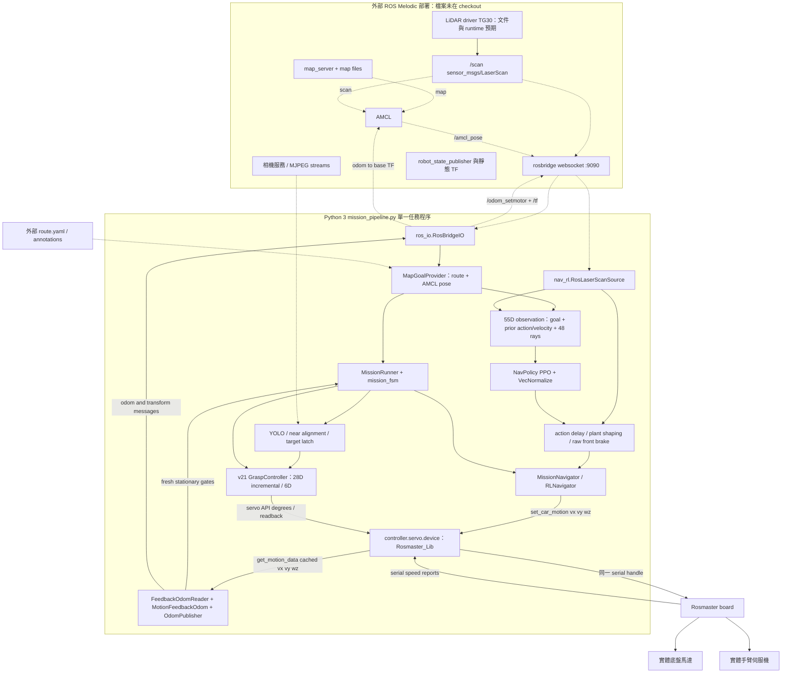
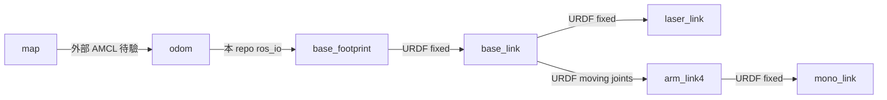
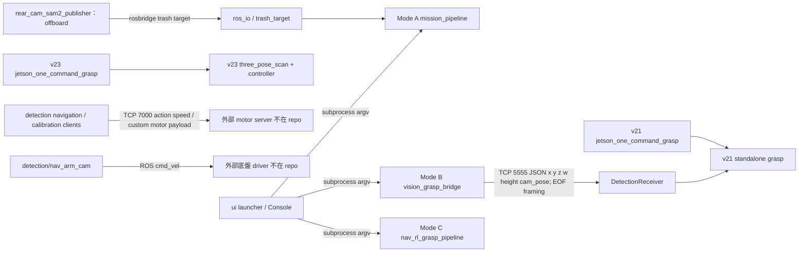

# Actual Runtime Architecture

2026-09-06 working-tree audit。實線表示可由本 repo 的 import、callback、函式呼叫或 socket code 確認的連接；虛線表示需要外部服務／部署檔才能成立。這是程式可形成的 runtime，不是本次已在機器人觀察到的 ROS graph。

## 1. 任務主線的實際資料流

實際 caller 依序是 `mission_pipeline.build_and_run()` → `_load_grasp_module()` 動態載入 **grasp/v21** → `GraspController` → `MissionNavigator(controller.servo.device, ...)`。任務層共享 servo 所持有的裝置，沒有另建「motor server」。`MissionNavigator` 繼承 `nav_rl_grasp_pipeline.RLNavigator`，後者繼承 `vision_grasp_pipeline.Navigator`。PPO goal 來自 `MapGoalProvider`，任務機切换 patrol / target approach / grasp / bin / resume。

**沒有在這條路徑找到 move_base action client、發 navigation goal 的 ROS topic 或 `/cmd_vel` 訂閱者。** Patrol 是選下一個 map waypoint 給局部 PPO；不能把 waypoint provider 稱為 global planner。AMCL 通常藉 TF 使用 odometry，本圖沒有假定 AMCL 必定訂閱 `/odom_setmotor`。

## 2. ROS contract / TF

| Interface | Producer / consumer | Type / frame / semantics | 查核結果 |
|---|---|---|---|
| /scan | 外部 driver → RosLaserScanSource | sensor_msgs/LaserScan；48 forward rays 的來源 | default yaw=0、CCW=+1、forward offset=0；使用自有轉換，非 TF lookup；需 orientation evidence |
| /amcl_pose | 外部 AMCL → RosBridgeIO → MapGoalProvider | geometry_msgs/PoseWithCovarianceStamped；預期 map | frame/quaternion/covariance 驗證不足，B15 |
| /odom_setmotor | OdomPublisher → RosBridgeIO | nav_msgs/Odometry；odom / base_footprint | 當前唯一可確認的主線 odom writer；board speed feedback 經0.65/0.501校正積分 |
| /tf | RosBridgeIO | tf2_msgs/TFMessage；odom → base_footprint | 與 odom 使用同組 pose/stamp；外部 owner 是否重複未知 |
| map → odom | 外部 AMCL（預期） | localization correction | launch/設定缺席，不能證明已啟用或唯一 |
| base_footprint → base_link | yahboomcar.urdf fixed joint | z=0.0815 m | 需外部 robot_state_publisher；本 repo 沒有啟動入口 |
| base_link → laser_link | yahboomcar.urdf fixed joint | x=.0435 m、y≈.00005258 m、z=.11 m | 全高約.1915 m；actual scan frame 若叫 laser，缺少其轉換的本地證據 |
| base_link → arm links → mono_link | URDF articulated chain | mono_link 掛在 arm_link4 | PyBullet FK 不是 ROS TF publisher；需要實際 joint_states 才能在 ROS 表現活動相機 |
| /cmd_vel | detection/nav_arm_cam.py → 外部未知 driver | geometry_msgs/Twist；queue_size=10 | legacy 旁路；主線 mission 不消費它 |

正式要求是一個 child frame 只有一個發布權威。URDF 固定 joint 與外部 static_transform_publisher 是否重複，需讀 robot 上的 launch，不能從 URDF 單独判斷。沒有發現可供直接比較的多份 AMCL YAML。

## 3. 其他確實存在的路徑

Mode B bridge **只有偵測 sender**，必須另有對應版本的 receiver；不是完整抓取 bringup。它傳入的 camera pose stamp 可由 receiver 在 latch 時比對實際 encoder，這個既有保護值得保留。不同 TCP 服務的 framing/payload 不可混用：5555 不是 motor command port。

v23 standalone 並未被 mission 動態 loader 選中。hidden `.claude/worktrees/*/x3plus` 是歷史快照（目前 git worktree list 只列根 checkout），不應因全文搜尋命中就當成 active runtime。`grasp/deploy_v23/` 是未追蹤的另一套交接來源，不能按名字當成 `grasp/v23/`。

## 4. 觀測與模型契約

- Navigation：55D / 2D，48 個 lidar rays + goal distance/sin/cos + previous executed velocity/raw action。PPO 輸出經兩步 delay、stall assist、near-obstacle shaping，再轉 SI 輪速。VecNormalize inference 應凍結，現行 loader 有設定。訓練 dynamics 參數不是任意調速度旋鈕。
- Grasp v21/v23：28D / 6D incremental，既有 `deploy_contract` 和 `action_execution_v21` 保留；v17 是相同 shape 的 absolute，不能以維度判兼容。
- Camera pixel → metric object position 需要 pose 相符的校正；C3、E1、travel home 是不同姿態。standalone bridge 的 homography gate 已存在，mission 類別重用未完整繼承，見 B03。
- Odometry 的 sensor input 是板端 motion feedback，並不是 raw encoder tick。文件中的「encoder odom」若指直接輪編碼器解算，在這份程式中沒有找到。

來源入口：[mission_pipeline.py](../../../integration/mission_pipeline.py)、[nav_rl.py](../../../integration/nav_rl.py)、[ros_io.py](../../../integration/ros_io.py)、[vision_grasp_bridge.py](../../../integration/vision_grasp_bridge.py)、[URDF](../../../grasp/x3plus/yahboomcar.urdf)。
