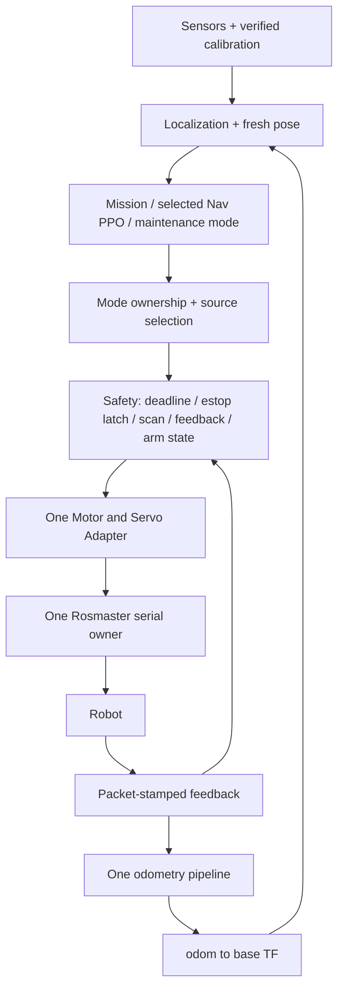

# Integration Plan

本輪只交付 audit。下列順序以保留已驗證 v21 功能、最小 patch、每項可獨立 rollback 為原則；沒有授予本次或後續自動讓實體機器人移動的權限。

## Canonical runtime 決策

| Function | Recommended canonical implementation | 理由與限制 |
|---|---|---|
| 任務 orchestration | integration/mission_pipeline.py + mission_fsm.py | 實際整合入口，已有 one-handle intent、patrol/grasp/bin/retry 和 offline tests；**不是已通過整機驗收** |
| 底盤 motor I/O | 現有 controller.servo.device 外加薄 adapter | 不新建另一個 Rosmaster owner；收斂所有 set_car_motion 到一處，先補 timeout、lock、exception結果 |
| Odometry | integration/feedback_odom.py + mission OdomPublisher + ros_io | 保留 Route A generation-3 校正常數，先修 packet freshness 與 clock；不是 command-integrated odom |
| ROS transport | integration/ros_io.py / nav_rl.RosLaserScanSource 的 rosbridge | Python3.8 與原生 ROS Melodic 分離；限制 bridge數量/生命週期，不全面改 rospy |
| LiDAR bringup | 實際 robot 的 TG30 ROS driver + /scan（待取回配置） | 主線已有 LaserScan adapter；直接 RPLidar 是可選 legacy backend，不可指向 TG30 或 motor serial |
| Localization / map | 外部 AMCL / map_server（待取回版本） | 本 repo 沒有替代實作；固定 map→odom owner 與 map hash |
| Navigation | integration/nav_rl.py 的現有55D PPO和成對VecNormalize | 與 mission caller 一致；保留訓練 plant契約，修 safety overlay；不假定 move_base 已整合 |
| Patrol / bin goals | integration/map_goal_provider.py | 已有 route/AMCL介面；補 delivery route、bin yaw、forbidden segment與map identity |
| Grasp integrated | grasp/v21/ + manifest所選模型對 | mission loader真正使用，HEAD已含jaw修正；保留 obs_28_incremental、floor/servo/pose/contact gates |
| Grasp candidate trials | grasp/v23/ standalone launcher | E1／three-pose掃描等新功能尚未接入mission；保持版本隔離與candidate限制 |
| 相機校正 | arm_cam_geometry + grasp_home_homography + pose-stamped bridge | 重用已存在的 measured projection；C3/E1不得靠同shape/檔名互換 |
| UI | ui/launcher.py → ui/server.py → mode-specific subprocess | 先修argv契約與port配置；UI不是另一層motor owner或hardware estop |

## Phase A：證據充足的最小修正

| Patch | Problem / Root cause | Change | Risk | Before → Patch → Validation |
|---|---|---|---|---|
| A1 | B07：Thread內部方法被Event同名覆蓋 | `_stop_event`，independent cleanup | Low；事件引用必須全改，stop順序保留 | 現有join重現失敗 → patch → 真thread start/stop/join與cleanup failure injection + mission tests |
| A2 | B06：EOF被視為同意 | fail closed，明確start事件 | Low；無人值守啟動行為改變是刻意修正 | 現有EOF會started → patch → Enter成功、EOF/OSError不啟動、Ctrl+C清理 |
| A3 | B09：通用UI argv不符合三個CLI | 各模式schema／能力表，實際parser smoke | Low至Medium；使用者dirty ui/server.py必須逐hunk保留 | 現有四情境exit2 → patch → A/B/C real/dry parser全測；real未滿足gate仍必須拒絕 |
| A4 | B08/B15/B16：資料存在不代表有效／新鮮 | consumption-time age、AMCL形狀/frame/數值驗證、scan coverage狀態 | Medium；避免誤拒合法inf scan或初始化AMCL | 注入凍結快照、錯frame、zero quaternion、negativecov、allNaN → patch → valid cases也保留 |
| A5 | B12：unknown vision被當成功 | 三態verification，pose/generation匹配 | Medium；任務可能多等或重試，但不能漏判成功 | 無有效frame現為True → patch → unknown不投放、不遞增成功計數；真實absence要有效觀測證明 |
| A6 | B02/B03：class reuse繞过entry gate | shared pre-open validation；暫停尚未校正的real integrated branch | Medium；原先能繞過的呼叫會被拒絕 | 正反契約fixture、custommodel、skiphash、candidate測試；驗證拒絕發生在裝置建立前 |
| A7 | B20：controller沒有close serial owner | idempotent complete teardown | Medium；避免同一handle doubleclose或接收thread尚在用 | fakepartialinit、doubleclose、其他cleanup拋例外後仍close；全部servo suites |

A4 的 packet freshness 需要實際 driver contract，因此 **B01 不能只靠在 reader 補 time.time() 就算修好**。A6 暫時拒絕不安全路徑是可由程式碼定案的修正；將其恢復為可動作功能需要完成後面的校正與驗證。

## Phase B：整合依賴順序

1. **Motor + feedback（B01/B04/B05）**：取回實際 Rosmaster_Lib 與 firmware資訊，確認serial報文是否有sequence；加入packet timestamp、singleowner、bounded command deadline。離線fake證明stalezero不能pass stationary，再進行架空／低速受控驗證。
2. **Odom + TF + Localization（B17/B22）**：保留0.65/0.501參數，驗feedback sign與m/s/rad/s；取得原launch，排除另一odom與staticTF；確認map→odom→base_footprint→base_link→laser_link。先stationary紀錄，再square/rotation，不憑文件重校正。
3. **Navigation（B10/B16/B21）**：raw scan safety與policyclippedrays分開；所有near/recovery命令經adapter；SI limits不可被scalar floor突破。PPO delay/stall-assist維持契約並檢查stop清空delay buffer，不盲目retrain。
4. **Patrol/bin（B13/B14）**：對实际route檔做map hash、座標/解析度、禁區線段和bin approach檢驗。補yaw alignment及placement envelope。沒有這些資料不宣稱全域導航可行。
5. **Grasp/vision（B03/B11/B12/B27）**：把homography projector作為Navigator依賴，輸出baseXY/poseidentity/validity；C3與E1各用自己的校正。完成floor/servo/contract regression才做固定目標實測，最後才恢復整合real入口。
6. **UI/master bringup（B09/B18/B19/B24）**：在前述契約穩定後連接單一profile，不讓UI自行拼接未支持的runtimeflags。

## Phase C：最後才做 cleanup

- 對相同 helper 採「差異檢查 → 寫清共享契約 → 小範圍抽出」，不合併v21/v23不同home、scan、calibration政策。
- 不刪root v17、reference、training、untracked deploy、hidden snapshots；先補用途與版本標籤，確認實際使用者再討論刪除。
- route/map/ROSlaunch是外部artifact，不透過建立空的placeholder檔假裝整合完成。
- CI增加已證明有價值的CLI/cleanup/freshness反例，以及Jetson Python3.8 import/model-loading smoke；保留3.12 offline lane。

## 完成條件

正式profile須做到：一個serialowner、一個wheelcommand出口、一個board-feedback odom、一個odom→base TF authority、一組有hash的map/route/calibration/model、一個被選中的controller模式、可界定停止延遲、影像／pose／feedback失效時停止、bin投放含heading gate。這些是後續驗收條件，**不以本輪32組offline測試通過代替實機整合驗收**。
